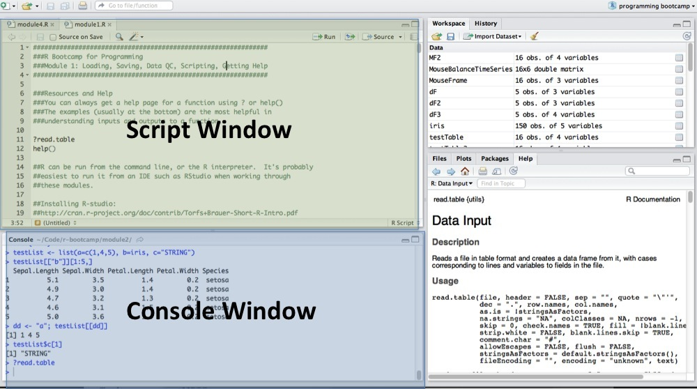

In this module, we'll give an overview to the larger assignment and a gentle introduction to R/Rstudio.

## Motivation for Prework

The LACE score is a summary score used in clinical data that is derived from 4 key clinical data elements in order to predict the probability of 30-day readmissions. Here are the individual elements of the LACE score:

* L = Length of stay
* A = Acuity of admission
* C = Comorbidities (scored by severity, and additive)
* E = Number of Emergency room admits 6 months prior to admission

In class on-campus, we will calculate each of these elements. Added together, the LACE score ranges from 1-14. The higher the score, the higher the probability of readmission.

Your overall goal in the pre-work will be to identify those cases in the dataset that are readmissions within a 30 day period. These are the cases for which we will then calculate the LACE score (in-class, on-campus) and examine how well it predicts readmissions.

In order to achieve this goal, we will be slowly be exploring R and SQL over the next seven weeks of on-campus work.

## Installing Software

Your goal this week will be to install two pieces of software that we'll use for analysis: R and Rstudio. Once you've installed it, we'll take a look at the interface, load in a built-in dataset, and do some simple summary statistics.

The first thing to do is to install R. Go to https://cran.r-project.org and download the appropriate binary for your system. If you are on a linux system and there is not a previously compiled binary for your distribution, you will need to install it with a package manager, such as `apt-get` or `conda`. R is the statistical language that we are going to do all of our work in. 

Secondly, we will install Rstudio. Go to http://www.rstudio.com and install the appropriate version for your system. Rstudio is what's called an *Integrative Development Environment* (IDE), which will make working with R much easier. In order to use it, you need to have R installed.

## Loading a built-in dataset and doing some summary statistics

Now that everything is installed, open up RStudio. Your first thing to notice is that there are two main windows on your left: The console window (the bottom window) and the scripting window (the top window). We will mostly work by writing scripts in scripting window and executing them in the console window by highlighting the code and using the Run command or CTRL-Enter (for Windows/Linux) or CMD-Enter (for Macs).



In the console window, load the built in Iris dataset with the `data()` command. This loads in a built in dataset called `iris`. Try this, and try getting help on this dataset by using `?iris`.

```{r}
data(iris)
#For more information, type the following in:
?iris
```

After reading the help file, we now know that the iris dataset is in `data.frame` format. This is the basic format that we'll be using for tables in R. We'll explore some properties of the data.frame by 

The first thing is to look at the data directly. If we use the `head()` command we can see the first few rows of the iris data. Each row in the `iris` data corresponds to a single flower that has been measured, and each column corresponds to a variable that was measured on that flower. 

```{r}
head(iris)
```

**QUESTION**: How many rows did `head()` return? 

We may want to know more information about the dataset. We can do some simple summary statistics by using the `summary()` function. Depending on the datatype of the column (numeric, character, or factor), we can calculate different summary statistics on the dataset. 

```{r}
summary(iris)
```

We might also want to know how many columns and rows there are in the dataset. We can use the `ncol()` and `nrow()` commands to find these:

```{r}
nrow(iris)
ncol(iris)
```

## Assignment Week 1 (1 point)

Answer these questions and submit as a .R file. Also note what code you used to find the answer.

1) How many rows are there total?
2) What is the maximum `Sepal.Length`? What units is it in? (Hint: look at the help file for the dataset again.)
3) How many `setosa` samples are there in the iris dataset? 

## How to submit

Submit your answer using the `week1Submission.Rmd` file. This is an RMarkdown file and you can mix code and text using it. You can open this file directly into Rstudio. 

Make sure to rename the `week1Submission.Rmd` file to `week1Submission-LASTNAME.Rmd` with your last name, so we can confirm that you submitted the assignment.

##For more information

Please refer to R-Bootcamp, [Module 1](https://github.com/laderast/r-bootcamp/tree/master/module1) and [Module 2](https://github.com/laderast/r-bootcamp/tree/master/module2) for more information on the Rstudio software and `data.frames`.

Also check out the DataCamp [Introduction to R](https://www.datacamp.com/courses/free-introduction-to-r) as another friendly introduction to R.