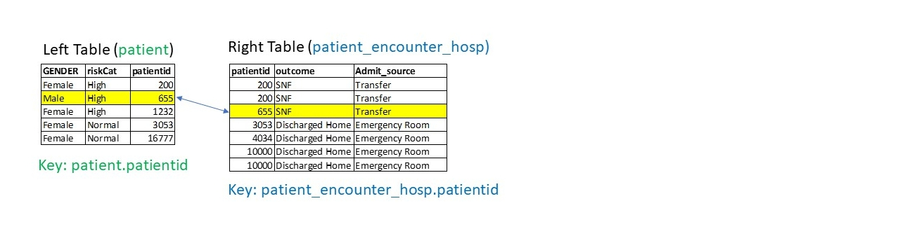
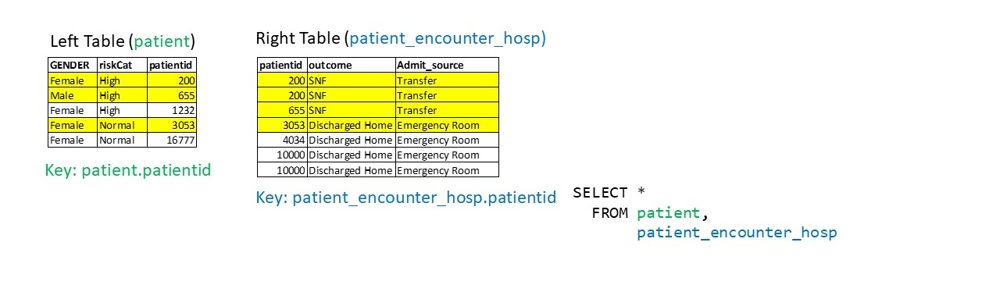

This week we will be querying our database. We'll also be doing simple joins and queries to show the power of SQLite. We'll also be using the CASE statement to identify cases that meet our criteria.

## Run me First

```{r}
library(RSQLite)
library(here)
library(tidyverse)
library(janitor)
#start our connection to the database
con <- DBI::dbConnect(RSQLite::SQLite(), here("data/patient1.sqlite"))
```

## Learning Objectives

- Understand the terminology behind joins: *Left Table*, *Right Table*, *Keys*
- Utilize this understanding to build SQL statements that join tables together
- Understand the difference between INNER JOIN and LEFT JOIN
- Chain a JOIN with a specific query using WHERE
- Use Aliases to make your queries shorter and easier to read
- Use the CASE clause to recode variables

## SQL Queries with Joins

Now that we have our SQLite database (our "data warehouse"), we can now start asking more complicated queries. 

For example: *How many high risk patients had emergency room admissions?*

In order to do this, we will do what is called a *database join*, where we map rows in one table (in this case the `patient` table) to another table (`patient_encounter_hosp`) through a mapping key, `patientid`. After we do the join, we can use our filtering criteria as before. We will do this by joining our criteria using a "where" statement.

## Some Terminology

[if you don't see the graphic below, click on the green play button on the code chunk below]

```{r}

```

`left table` and `right table`: Whenever we join two tables, we will have a *left* table (in this case, the `patient` table) and a *right* table (in this case, `patient_encounter_hosp`, see above). Note we've simplified both tables and removed.

`key`: we want to answer a question about our patients, so we have to somehow map the rows of our left table (`patient`) with the rows of our other table (`patient_encounter_hosp`). We do this by joining together rows with a common variable. In our case, we need to join rows based on `patientid`. The variable that we join on is called a *key*. 

In the above example, we see that there is a row in `patient` whose `patientid` is 655, and there is a row in `patient_encounter_hosp` whose `patientid` is 655 as well. So it makes sense to join these two rows together.

Note that the name of this variable is the same for both `patient` and `patient_encounter_hosp`. We'll need to use the dot notation to refer to each variable precisely: `patient.patientid` and `patient_encounter_hosp.patientid`.

## JOINing Syntax

```{r}

```


How do we actually write a query that produces one table from both of our tables? We need to add a "JOIN" clause to our SQL statement. 

Again, we know we want to map rows together that have the same patient table, so we need the condition `patient.patientid = patient_encounter_hosp` somewhere.

Here's the syntax for a JOIN statement, called INNER JOIN. 

```
SELECT [columns] FROM
   [Left Table] INNER JOIN [Right Table] ON
   [left table key] = [right table key]
```

In our example above, this is:

```
SELECT * FROM
   patient INNER JOIN patient_encounter_hosp ON 
   patient.patientid = patient_encounter_hosp.patientid
```

```{r}
knitr::include_graphics("image/Slide3.JPG")
```


## Run the query

Try running the INNER JOIN query above, but sub `SELECT COUNT(*)` instead of SELECT *. How many rows did this query return?

```{r}
#put your modified query here.
sqlStatement <- "SELECT COUNT(*) FROM patient"
joined_table <- tbl(con, from=sql(sqlStatement))
joined_table
```


## A Different kind of JOIN: LEFT JOIN

```{r}
knitr::include_graphics("image/Slide4.JPG")
```

We have seen the INNER JOIN, which only returns a merged table whose keys are in both tables. In some ways, we have thrown away some information from both the left table and the right table. 

There are two other ways to join the data. The first is a LEFT JOIN, where we want to return all rows in the left table (`patient`) regardless of whether the row has a key match in the right table. In our example above, there are two rows (patientid 1232 and 1677), which don't have corresponding rows in the right table. 

We specify our left join with the following syntax:

```
SELECT * FROM patient 
   LEFT JOIN patient_encounter_hosp ON
   patient.patientid = patient_encounter_hosp.patientid
```

Depending on your query, it may make sense to retain unmapped keys. For example, if you were running a query over all patients in the hospital, it makes sense to do a LEFT JOIN.


## Aliases: Shortcuts so you don't have to type as much


One good shortcut that can prevent you from typing too much in your queries is creating *aliases* (or shortcuts) for a table name using the `AS` statement. Here we rewrite the above statement by specifying the alias `p1` for the `patient` table and the alias `peh` for the `patient_encounter_table`. Note that even though the `SELECT` statement goes before our declaring the aliases, it's ok to use the the alias anyway.

```{r}
sqlStatement <- "SELECT p1.patientid, p1.riskCat, peh.Admit_source, peh.outcome 
                 FROM patient AS p1
                 INNER JOIN patient_encounter_hosp AS peh ON 
                  p1.patientid = peh.patientid
                 WHERE 
                  p1.riskCat = 'High' AND 
                  peh.Admit_source = 'Emergency Room'"

queryResult <- tbl(con, sql(sqlStatement))

#show first ten rows of result
queryResult
```

Strictly speaking, we don't need `AS` to declare an alias, we can just put the alias following the table or variable of interest. The following is identical to the above query, except we provide a new alias for `Admit_source` (`ads`) and `outcome` (`o`):

```{r}
sqlStatement <- "SELECT p1.patientid, riskCat, Admit_source ads, outcome o 
                 FROM patient p1 INNER JOIN patient_encounter_hosp peh
                 ON p1.patientid = peh.patientid
                 AND p1.riskCat = 'High' 
                 AND peh.Admit_source = 'Emergency Room'"

queryResult <- tbl(con, sql(sqlStatement))

#show result
queryResult
```

**QUESTION**: How would we modify this query to select `Normal` Risk patients who had an outcome of `Rehab`?

## The CASE statement

Sometimes you just want to code whether a row in a table meets a particular criteria or not. This can be useful when chaining queries or as a 'dummy' variable in statistical analysis. You can do this by using the `CASE` statement. 

The case statement has the following syntax:

```
CASE WHEN [condition] 
     THEN [expression1] 
     ELSE [expression2] END 
```

In the `[condition]` slot, we can add any filtering criteria. If our `[condition]` is met, then the SQL statement executes `[expression1]`. If it isn't met, then the SQL statement executes `[expression2]`. 

Let's modify our above statement to use a case statement instead of a WHERE statement, such that our new variable will equal 1 (which is our `[expression1]`) when it equals the query (`patient.riskCat = 'High' AND patient_encounter_hosp.Admit_source = 'Emergency Room'`) and 0 otherwise (which is our `[expression2]`). We define a new variable `highRiskER` in our returned results by specifying it after the CASE statement.

```{r}
#note the comma before the case statement!
#we are 
sqlStatement <- "SELECT patient.patientid, riskCat, Admit_source, outcome, 
                 CASE 
                    WHEN
                      patient.riskCat = 'High'  
                      AND patient_encounter_hosp.Admit_source = 'Emergency Room'
                    THEN 1
                 ELSE 0 
                 END highRiskER
                 FROM patient INNER JOIN patient_encounter_hosp
                 ON patient.patientid = patient_encounter_hosp.patientid"
                 

queryResult <- tbl(con, sql(sqlStatement))

#confirm that our case statement worked (there are two rows here that meet the criteria)
queryResult
```

Here's another way to confirm whether our query worked:

```{r}
#another way to confirm the query worked 
#confirm that those cases with highRiskER == 1 meet our criteria
collectedResult <- collect(queryResult)

filteredResult <- collectedResult[collectedResult$highRiskER == 1,]

filteredResult[1:20,]
```

Compare this statement to the previous SQL statement. Note the placement of the `CASE` statement compared to the placement of the the `WHERE` statement in the two queries.

Now that we have our `highRiskER` coded, we can ask some questions that require crosstables. For example, how many high risk patients have an `SNF` outcome (i.e., ended up in a Skilled Nursing Facility) versus normal patients? 

Here I use the `janitor::tabyl()` function, but you can also write a SQL query to do this using CASE and COUNT statements. In order to do so, I simply build a crosstable between the `highRiskER` and the `outcome` variables.

```{r}
#note that we have to specify the variable names using the $ operator
collectedResult %>% 
   janitor::tabyl(highRiskER, outcome)
```

## Be sure to disconnect!

```
dbDisconnect(con)
```

## Week 3 Assignment (2 points)

Submit this week's assignment using the `week3Submission.Rmd` file.

