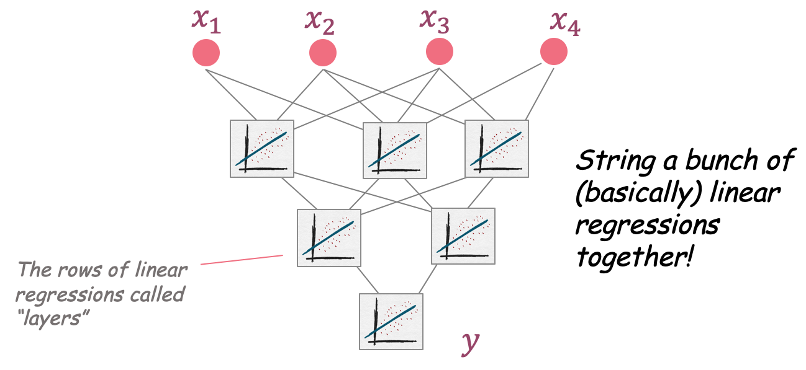
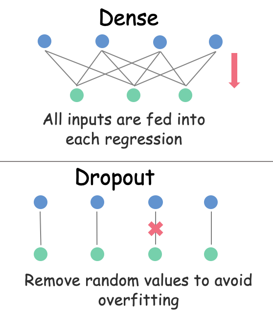

```{r setup, include=FALSE}
knitr::opts_chunk$set(echo = TRUE)
```


# Background

As mentioned in the last module, cardiovascular disease risk is mediated by many factors, including (but not limited to) `bmi`, `age`, and `gender`. Today, we will use machine learning techniques to predict whether or not a patient is at risk for cardiovascular disease given a set of known information.

We'll be using the synthetic patient dataset, `cvd_patient` that we used in the logistic regression notebook. Even though we performed a summary on this data last time, it's always good practice to reinspect in case anything has changed.

```{r, message=FALSE}
library(tidyverse)
library(caret)
#library for decision trees
library(party)
library(ROCR)
#library for neural networks
library(keras)

## load da## load dataset
cvd_patient <- readRDS('data/cvd_data.Rds')

## inspect data
summary(cvd_patient)
```

Everything still looks good here. We have a number of covariates we might use to predict whether a patient has cardiovascular disease. Please refer to the [Data Dictionary](https://github.com/laderast/cvdNight1/blob/master/data/dataDictionary.pdf) for more information about these covariates (note that we are only looking at a limited set of covariates in this dataset, so the number of covariates in the data dictionary is not going to match).


# Separating Our Data

We're going to want to check the predictive power of the model, so we'll want to partition our data into separate train and test sets, using the `createPartitionData()` function in `caret`. Reminder: `createPartitionData()` returns a number of row indices that we can use to subset the data into two sets:

1) Test dataset (20% of our data), which we’ll use to test our model’s predictive value

2) Training dataset (80% of our data), which we’ll use to actually build (or train) our model.

```{r}
## set the random seed - necessary for comparing this with machine learning doc.
set.seed(555)

## grab indices of the dataset that represent 80% of the data
train_idx <- createDataPartition(y = cvd_patient$cvd, p = 0.80, list=FALSE)

## show the first few training indices
train_idx[1:10]

## select the rows
train_data <- cvd_patient[train_idx,]

## confirm the number of rows (should be 80%)
nrow(train_data)

## build our test set using the R-indexing
## using the "-" operator
test_data <- cvd_patient[-train_idx,]

## confirm the number of rows 
nrow(test_data)

## check the distribution of classes
table(train_data$cvd)
```

Notice above that we have an imbalanced dataset (i.e. there are far more people in our dataset *without* CVD than there are with CVD). For simpler machine learning models, this doesn't pose much of an issue. 

More advanced methods, however, will tend to overfit to the more-represented class. What does this mean in practice? It means our model would likely be very good at predicting when someone *doesn't* have CVD, but might suffer when they *do* have CVD.

We can get around this issue by *upsampling* or *downsampling* our dataset. With *upsampling*, we randomly draw samples from the smaller class and add them to our dataset until the classes are balanced. This leaves us with a large, balanced dataset, *but* it will contain many repeats of the smaller class and could still lead to our model overfitting on the less-represented class.

*Downsampling*, on the other hand, randomly removes instances from the more-represented class until the class sizes are equal. The pitfall here is that the overall dataset size will only be twice as large as the number of instances in the less-represented class, *but* it won't contain any repeat observations.

Given the models we're going to train, 11,256 samples (2 * less-represented class) *should* be enough, so we will use downsampling with the `downSample()` function in `caret`. This function automatically creates a new column named `Class` and orders the rows by `Class`. We'll remove `Class` and keep the `cvd` column since they contain the same information, then reshuffle the dataset.

Below, you'll also notice use of the pipe operator (`%>%`). This essentially allows us to 'pipe' the output of one function into another and reduce the amount of verbage in our code. [Read more about it here.](https://magrittr.tidyverse.org/)

```{r}
## downsample our training dataset to the lowest-represented class and remove the 'Class' column
train_data <- downSample(train_data, train_data$cvd) %>%
  select(-Class)

## show the downsampled data
head(train_data)

## reshuffle the dataset since downSample() orders the dataset by class
## i.e. all 0s are at the top and 1s are at the bottom
shuffle_idx <- sample(nrow(train_data))
train_data <- train_data[shuffle_idx,]
head(train_data)

## let's check the distribution of classes again, just to be sure everything worked
table(train_data$cvd)
```


# Decision Trees

A decision tree is a machine learning method that uses a tree-like structure to perform classification or regression. Each node of the tree corresponds to a feature of the dataset (e.g. age, gender, etc.) and each leaf corresponds to a class label (e.g. cvd or no cvd). This algorithm first chooses the feature that best separates the data into respective classes, then adds subsequent nodes to further separate the data, as necessary. Although this model may not perform quite as well as more advanced methods, a major benefit lies with its interpretability.

## Training

Now we train our decision tree. To create a split (i.e. two diverging branches), we require there to be at least 30,000 samples in the node being split AND a terminal node can contain no less than 15,000 samples. We *could* allow smaller numbers here, but this could lead to overfitting of our model.

Note that we're using the formula interface here to describe which variables are predictors, and which variable is the outcome. Specifically, we specify;

`cvd ~ age + htn`

Here, `cvd` is our outcome variable, and `age` and `htn` are the predictors.
 
```{r fig.width=12}
## train the decision tree and plot its structure
decision_tree <- ctree(cvd ~ age + htn, data = train_data, controls = ctree_control(minbucket = 10000, minsplit = 30000))
plot(decision_tree)
```

Here's the structure of our model. The probability bars at the terminal nodes tell us two things:

1) Which class a sample will be classified as if it lands in said node
2) The probability that it actually belongs to that class

So, the far left bar is a `N` for `cvd` (i.e. the person *does not* have CVD). Out of all the training samples used to build this tree, ~8% were misclassified (the darker gray area). In contrast, the far right bar is `Y` for `cvd` (i.e. the person *does* have CVD) and the number of training samples correctly classified as such were around ~55%.

## Testing

For machine learning, training set performance isn't necessarily indicative of real-world performace. That's why we use a held-out test set. Let's see how well our model really works, by evaluating its performance on the test dataset.

```{r}
## get probability predictions of being in each class for each sample in the test dataset
tree_predictions <- predict(decision_tree, newdata = test_data, type = 'prob') %>%
	map_df(~as.data.frame(t(.)))

## compare the probability predictions to the class labels
tree_pr <- prediction(tree_predictions$V2, test_data$cvd)

## evaluate the performance of the model over a range of probabily thresholds
tree_perf <- performance(tree_pr, measure = "tpr", x.measure = "fpr")

## calculate the area under the receiver operating characteristics curve
tree_auc <- performance(tree_pr, measure = "auc")
tree_auc <- tree_auc@y.values[[1]]

## plot our results
plot(tree_perf, main="ROC")
abline(a=0, b=1, col='red', lty=2)
text(0.5, 0.15, paste('AUROC: ', round(tree_auc, 3)))

## we can also use the confusionMatrix() function to create a confusion matrix AND list other summary statistics
tree_conf <- confusionMatrix(as.factor(if_else(tree_predictions$V2 < 0.5, 'N', 'Y')), test_data$cvd, positive = 'Y')
tree_conf
```

We can see that the AUC isn't great (`r round(tree_auc, 3)`), but definitely better than chance! Also, note that while sensitivity is fairly high (`r round(tree_conf$byClass[1], 3)`), specificity is on the lower end (`r round(tree_conf$byClass[2], 3)`). That said, we've built a *highly* interpretable model and easy-to-use model. The set of rules in the decision tree would be fairly straightforward for a physician to memorize and could use this model in their practice.

# Neural Networks
While the decision tree is highly interpretable, it leaves much to be desired in terms of performance. Artificial neural networks (ANN) are another type of machine learning algorithm that simulate biological neural networks to perform classification or regression. An ANN can have many layers, and each layer can contain many nodes, and all of these nodes have weighted connections between them. Each node in a layer can actually just be thought of as a regression function and neural network is simply stringing these all together.

<center>

</center>

For now, imagine that nodes are simply ON/OFF switches and the weighted connections turn those switches ON or OFF. During the training process, we adjust these weights so that the single node in the final layer is ON when a person has CVD and OFF when they do not. If you're interested in learning more, you should check out [Jacqueline Nolis' presentation on Deep Learning.](https://nolisllc.com/assets/presentations/rnyconf-1-deep-learning.pptx)

## Data Manipulation

For most machine learning tasks, we will want to normalize our feature vectors into the [-1, 1] or [0, 1] range. This is because the weights were are adjusting for are in the range 0 to 1. So, if we multiply these weights by a large value (e.g. `tchol == 245`), then the algorithm might assume that `tchol` is a more important predictor than, say, `gender`, which would be binarized to equal either 0 or 1.

To do this, we will first use the `data.matrix()` function to convert our dataframe into a data.matrix (all values become numeric). Then, for each value in a column, subtract the smallest value found in that column. Finally, that value by the difference between the maximum and minimum values in said column. This will put each value in a column into the [0,1] range.

```{r}
## some Intel CPUs need this option set for Keras to work
## if in doubt, just leave this command uncommented
Sys.setenv('KMP_DUPLICATE_LIB_OK'='True')

## first let's remember what our data looks like
head(train_data)

## normalize data
scaled_train <- apply(data.matrix(train_data), 2, function(x) (x-min(x))/(max(x) - min(x)))
scaled_test <- apply(data.matrix(test_data), 2, function(x) (x-min(x))/(max(x) - min(x)))

## our dataset still contains all of the same information, but values are now numeric and range from 0 to 1
head(scaled_train)
```


## Training
Now we can begin building our model. Just so we can compare apples to apples, we'll only use the variables `age` and `htn`, since that's what we used in the decision tree model.

To begin, we tell `keras` that we're going to be building a sequential model (i.e. layer 1 feeds into layer 2, and layer 2 into layer 3, etc.). Then we use the pipe operator to add our layers. The first layer we'll add is a fully-connected dense layer consisting of 140 nodes. Each node will have the ReLU activation function applied to it. We then pass the information from that layer to the next layer, which also contains 140 nodes that use the same activation function. That layer then passes to the final layer, which contains a single node with a sigmoid activation function, since we're performing binary classification.

You'll notice that in between each of the dense layers is a 50% dropout layer. What this does is, during training, the model randomly selects 50% of the weights and sets them to 0. This is a form of regularization that helps prevent the model from overfitting to the dataset.

<center>

</center>

```{r}
## instantiate the model framework and let keras know we'll be building a sequential model
model <- keras_model_sequential()

## add fully-connected/dense layers to our model with dropout for regularization (i.e. to prevent overfitting)
## scaled_train[,c(2,6) selects all rows from columns 2 and 6 (age and sbp) of the training data
model %>%
	layer_dense(units = 140, activation = 'relu', input_shape = ncol(scaled_train[,c(2,6)])) %>%
	layer_dropout(0.25) %>%
	layer_dense(units = 140, activation = 'relu') %>%
	layer_dropout(0.25) %>%
	layer_dense(units = 1, activation = 'sigmoid')

## compile the model
## since this is a binary classification problem, we use binary crossentropy as our loss metric
## we'll use simple stochastic gradient decent as our optimizer
## and we'll monitor the accuracy of both the train and test sets to let us evaluate model performance
model %>% compile(loss = "binary_crossentropy", optimizer = optimizer_sgd(lr = 0.1), metrics = c('acc'))
```

The model summary above shows that our model was built as described, so we're ready to begin training. We pass the `fit` argument to `model` and specify that we'd like to train using as subset of the `scaled_train` matrix and that the associated labels are in another subset of the same matrix. Furthermore, we tell our model to use the last 20% of the dataset for validation so that we can monitor the training process and avoid overfitting. Finally, we tell the algorithm to update the weights of our model every time 5000 samples from the training dataset pass through (`batch_size`) AND that we'd like the whole training dataset to be trained on 25 times (`epochs`).

We'd like to compare this model to the decision tree above. To do so, we need to select the predictor variables, and split those into separate X and Y matrices.

```{r, results='hide'}
## select our predictor and outcome variables 
scaled_train_x <- scaled_train[, c('age','htn')]
scaled_train_y <- scaled_train[, 'cvd']

## train the model
training <- model %>% fit(x = scaled_train_x, y = scaled_train_y, validation_split = 0.20, batch_size = 5000, epochs = 25)
plot(training)
```

## Testing

Here we are using our neural net to predict `cvd` on the `scaled_test` set. Once we have the predictions, we can use different metrics, such as ROC and sensitivity and specificity to understand the performance of our model.

```{r}
## as before, we have our model make predictions on the test dataset
nn_predictions <- model %>% predict_proba(scaled_test[,c(2,6)])

## compare those predictions to the true class labels
nn_pr <- prediction(nn_predictions, scaled_test[,1])

## evaluate the performance of the model
nn_perf <- performance(nn_pr, measure = "tpr", x.measure = "fpr")

## calculate the AUC of the model
nn_auc <- performance(nn_pr, measure = "auc")
nn_auc <- nn_auc@y.values[[1]]

## plot the model performance
plot(nn_perf, main="ROC")
abline(a=0, b=1, col='red', lty=2)
text(0.5, 0.15, paste('AUROC: ', round(nn_auc, 3)))

## we can also have the neural network output the predicted class (rather than class probability)
nn_classes <- model %>% predict_classes(scaled_test[,c(2,6)])

## then use that as input to confusionMatrix()
nn_conf <- confusionMatrix(as.factor(nn_classes), as.factor(scaled_test[,1]), positive = '1')
nn_conf
```

With the simple neural network we've built, we've increased the AUC to `r round(nn_auc, 3)`. A closer look shows us that, although the *overall* AUC is similar, the sensitivity (`r round(nn_conf$byClass[1], 3)`) actually dropped a bit, but specificity (`r round(nn_conf$byClass[2], 3)`) increased.

But how is this model making its predictions? Which factors are important? Which aren't? Unfortunately, with neural networks and other advanced machine learning techniques, they can be hard to interpret and are often referred to as "black boxes." As it currently stands, there is a definite trade-off between model performance and model interpretability. We'll talk more about this for the in-class week.


## Week 8 Assignment

Please refer to the `week8submission.Rmd` file in the workspace. 
